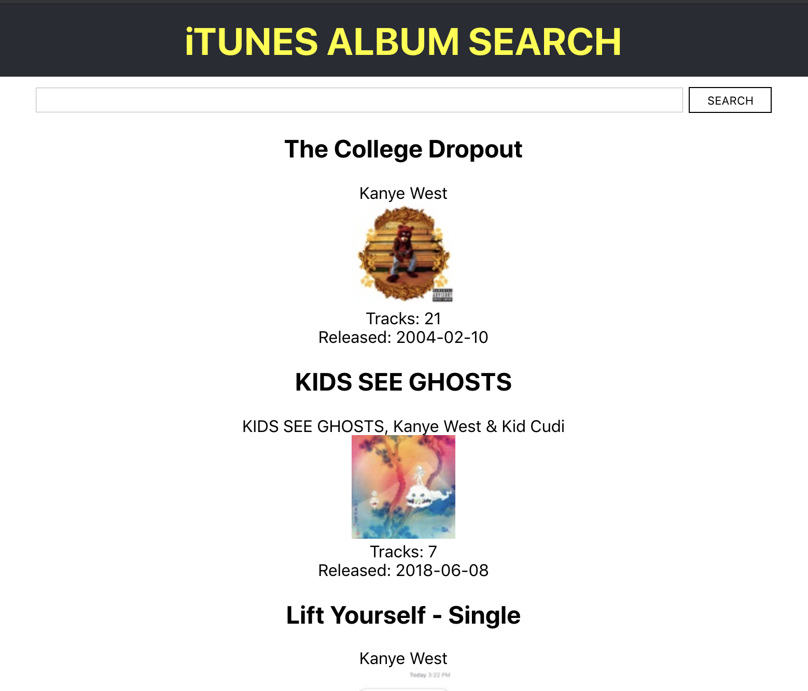

# Name of the project &middot; [](https://travis-ci.org/npm/npm) [](https://www.npmjs.com/package/npm) [](http://makeapullrequest.com) [](https://github.com/your/your-project/blob/master/LICENSE)

> React app using iTunes search API


[github page](https://kokospapa8.github.io/react-itunes-search/)

This is an sample react app to demonstrate 'hook', credits to
[samie820](https://github.com/samie820/hooks-movie-app/)

## Installing / Getting started

you need Node (≥ 6)

```
> npm install -g create-react-app
> npm install gh-pages --save-dev
> npm install --save react-bootstrap
> npm install --save react-infinite-scroll-component
> npm start
```

### Built With

React, reducer

### Prerequisites

N/A

## Tests

`npm test`

## deploy

refered this [react-gh-pages](https://github.com/gitname/react-gh-pages) to deploy this on github

```
> npm run deploy
> git add .
> git commit -m "<message>"
> git push origin master
```

## Api Reference

[iTunes Search API](https://affiliate.itunes.apple.com/resources/documentation/itunes-store-web-service-search-api/)
[swagger](https://kokospapa8.github.io/swagger-itunes-search-api/)

I used itunes search api to get results of albums and more

### TODO:

- refer to [issues](https://github.com/kokospapa8/react-itunes-search/issues)

## Credits

- [tutorial](https://www.freecodecamp.org/news/how-to-build-a-movie-search-app-using-react-hooks-24eb72ddfaf7/)
- [creat-react-app](https://reactjs.org/docs/create-a-new-react-app.html)
- [react-bootstrap](https://react-bootstrap.github.io/)
- [react-infinite-scroll](https://www.npmjs.com/package/react-infinite-scroll-component)
